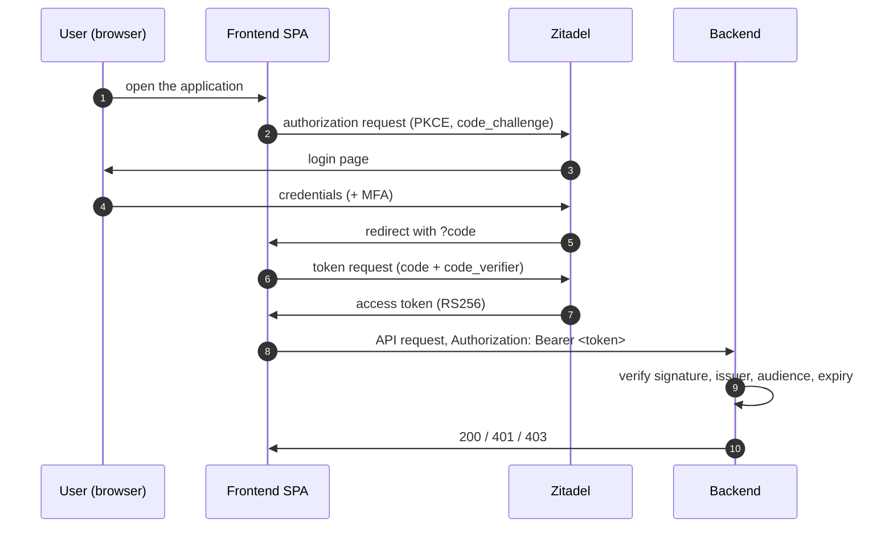

# Authentication and authorization

The backend is a pure OIDC **resource server**: it never issues, refreshes or stores tokens.
Clients obtain access tokens directly from Zitadel and present them as bearer tokens. Authentication
answers *who the caller is*, RBAC answers *what the caller may do*; both are always enabled.

## Login flow

The frontend is a public OIDC client of the Zitadel project using Authorization Code with PKCE, so no
client secret is shared with the browser.



## Token validation

1. **Algorithm** — only asymmetric algorithms the provider advertises and the library supports
   (`RS256` with Zitadel) are accepted; `none` and HMAC tokens are rejected.
2. **OIDC** (`coreos/go-oidc`) — the discovery document and JWKS are fetched at startup and refreshed
   when an unknown `kid` appears, then signature, `iss`, `aud` and `exp` are checked.
3. **Subject** — a token without `sub` is rejected; `sub` is the user identity (not an e-mail).
4. **Roles** — role names are taken from the claim named by `SD_OIDC_ROLES_CLAIM`; only names
   configured through `SD_RBAC_ROLES_*` are considered.
5. **Audit logging** — every outcome is logged as `auth_audit` with `action`, `result`, `idp_type`,
   `username` and `reason`, in a SIEM-friendly structure.

## Middleware

| Middleware | No token | Invalid token | Effect |
| --- | --- | --- | --- |
| `AuthenticationMW` | `401` | `401` | hard authentication for every write route |
| `SetJWTClaims` | anonymous | `401` | soft authentication for read routes |
| `RBACAuthorizationMW` | – | – | `403` when the token's role names map to no application role |
| `DenyReporterScopeMW` | – | – | `403` when the caller resolves to the `reporter` role |
| `CheckEventExistenceMW` | – | – | `404` for an unknown `:eventID` before the handler runs |

Two deliberate exceptions: `POST /v2/events` omits `DenyReporterScopeMW` because reporting system
incidents is the one write a reporter may perform, and `POST /v1/component_status` predates RBAC — it
rejects reporters, but a token whose role names map to no application role is still accepted there.

## Configuration

OIDC is mandatory — the application fails to start when it is missing or inconsistent.

| Variable | Required | Default | Notes |
| --- | --- | --- | --- |
| `SD_OIDC_ISSUER` | yes | – | validated together with `SD_OIDC_CLIENT_ID`; the discovered issuer must match exactly |
| `SD_OIDC_CLIENT_ID` | yes | – | the audience accepted in `aud` |
| `SD_OIDC_ROLES_CLAIM` | no | `urn:zitadel:iam:org:project:roles` | |
| `SD_OIDC_USERNAME_CLAIM` | no | – | display name only, never used for identity |
| `SD_RBAC_ROLES_ADMINS` | yes | – | |
| `SD_RBAC_ROLES_OPERATORS` | no | – | |
| `SD_RBAC_ROLES_CREATORS` | no | – | |
| `SD_RBAC_ROLES_REPORTERS` | no | – | |

Each `SD_RBAC_ROLES_*` variable accepts one role name or a comma-separated list of role names, all
mapped to the same application role. Names are matched case-sensitively and a leading `/` is ignored
(Zitadel writes project roles as `/<project>/<role>` in some setups).

```shell
SD_RBAC_ROLES_ADMINS=sd_admins,status-dashboard
```

The pre-Zitadel `SD_RBAC_GROUPS_*` variables are still read for one release: they fill a role only
when the corresponding `SD_RBAC_ROLES_*` variable is empty, and their presence logs a deprecation
warning. `SD_AUTHENTICATION_DISABLED` and `SD_RBAC_DISABLED` have been removed — there is no bypass.

## Roles

| Role | Priority | Scope |
| --- | --- | --- |
| `admin` | 50 | everything; reserved for future system-level privileges |
| `operator` | 30 | event admin: unrestricted access to all maintenance events |
| `creator` | 10 | create and manage own maintenance events |
| `reporter` | 5 | machine principal: only system incidents, read-only everywhere else |

The highest mapped role wins when a token carries several role names, so a principal with both a
`reporter` and a `creator` name behaves as a creator. `reporter` is deliberately *not* a step on the
privilege ladder but a machine-only scope.

## Permissions

### Creating events — `POST /v2/events`

| Role | `maintenance` | `incident` | `incident` with `system: true` | `info` |
| --- | --- | --- | --- | --- |
| `creator` | `pending_review` | yes | yes | yes |
| `operator` / `admin` | `planned` | yes | yes | yes |
| `reporter` | `403` | `403` | yes | `403` |

A caller whose role names map to nothing is rejected with `403` before the handler runs.

### Patching events

| Type | Rule |
| --- | --- |
| `maintenance` | operator/admin unrestricted; creator only on own events, only from `pending_review` and only to `pending_review` or `cancelled` |
| `incident` | any role from `creator` up; the constraints are the incident state machine, see [events.md](events.md) |
| `info` | any role from `creator` up, no ownership check |

For maintenance events `version` is required (`400` when it is missing) and a stale value yields
`409`; other types also honour the version when it is sent.

### Creating components — `POST /v2/components`

Any role except `reporter`.

### Extracting components — `POST /v2/events/:eventID/extract`

Requires operator or admin. A creator receives `403`.

### Reads and field visibility

| Field | Anonymous | Authenticated |
| --- | --- | --- |
| `creator`, `contact_email`, `version` | hidden | visible for `creator` role and above |
| `pending_review` / `reviewed` maintenance | hidden (404) | visible |
| maintenance cancelled before reaching a public status | hidden (404) | visible |
| `pending_review` / `reviewed` entries inside `updates` | filtered out | visible |

Machine principals holding only the `reporter` role are treated as anonymous for reads, and the
extended view applies to `GET /v2/events`, `GET /v2/events/:eventID` and their deprecated
`/v2/incidents` aliases. The v1 read endpoints and the RSS feeds always use the public view.
`incident` and `info` events are never hidden, whatever their status.

## Error reference

| Code | Condition |
| --- | --- |
| `400` | invalid body, missing required field, malformed e-mail, `end_date` before `start_date` |
| `401` | missing or invalid token |
| `403` | no mapped role, insufficient role, foreign event, reporter outside `POST /v2/events` |
| `404` | unknown event, or an event hidden from the caller |
| `409` | transition not allowed for the current state, or a stale `version` |
| `500` | database or unexpected server error |
