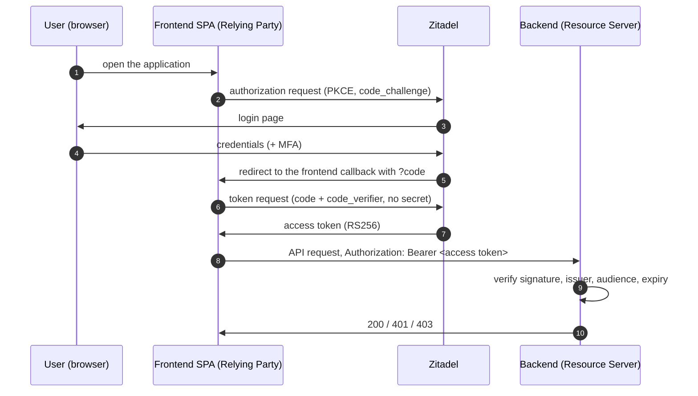

# Authentication

The backend is a pure OIDC **resource server**: it never issues, refreshes or stores
tokens. Clients (the frontend SPA, and service principals such as `metrics-processor`)
obtain access tokens directly from Zitadel and present them as bearer tokens.

## Login flow

The frontend is a public OIDC client of the Zitadel project and uses Authorization Code
with PKCE (`oidc-client-ts`). No client secret is shared with the browser.



## Token validation

Every request that carries a bearer token is validated:

1. **Algorithm** — only `RS256` is accepted; `none` and the HMAC variants are rejected.
2. **OIDC verification** (`coreos/go-oidc`) — the issuer discovery document and JWKS are fetched
   once at startup and refreshed on demand when an unknown `kid` is seen, then the signature,
   `iss`, `aud` and `exp` claims are checked.
3. **Subject** — a token without a `sub` claim is rejected; the subject is the user identity.
4. **Roles** — role names are read from the claim named by `SD_OIDC_ROLES_CLAIM`, keeping only
   the names the resource server knows (`SD_RBAC_ROLES_*`). See [rbac.md](rbac.md).
5. **Audit logging** — every outcome is logged with `idp_type`, `username`, `result` and `reason`.

### Middleware variants

| Middleware | Behavior on missing/invalid token | Used for |
|-----------|----------------------------------|----------|
| `AuthenticationMW` (hard-auth) | Returns `401 Unauthorized` | Write endpoints (POST, PATCH) |
| `SetJWTClaims` (soft-auth) | Continues without user context | Read endpoints (GET) |

Both delegate to a shared `authenticate()` helper.

## Configuration

OIDC is mandatory — the application fails to start with a clear error when it is missing.

| Variable | Required |
|----------|----------|
| `SD_OIDC_ISSUER` | Yes |
| `SD_OIDC_CLIENT_ID` | Yes |
| `SD_OIDC_ROLES_CLAIM` | No — defaults to `urn:zitadel:iam:org:project:roles` |
| `SD_OIDC_USERNAME_CLAIM` | No — display name only, never used for identity |

Example:

```shell
SD_OIDC_ISSUER=https://zitadel.example.com
SD_OIDC_CLIENT_ID=your-zitadel-project-id
```

`SD_OIDC_ISSUER` and `SD_OIDC_CLIENT_ID` are validated together: setting only one of them is a
startup error, and the discovered issuer must match `SD_OIDC_ISSUER` exactly.

`SD_OIDC_CLIENT_ID` is the **audience** every accepted token must be issued to. Zitadel access
tokens always contain the project id in `aud`, so pointing `SD_OIDC_CLIENT_ID` at the project id
accepts every application of that project. Use a specific client id instead to accept only the
tokens issued to that client.

`SD_AUTHENTICATION_DISABLED` has been removed.

## Getting a token for a machine client

Interactive tokens come from the browser flow above. Machine clients (for example
`metrics-processor`) use a Zitadel service user with a private JWT (`client_assertion`), so no
shared secret is stored, and request the project audience so the token carries the project in
`aud`:

```shell
curl -X POST "$SD_OIDC_ISSUER/oauth/v2/token" \
  -H "Content-Type: application/x-www-form-urlencoded" \
  -d "grant_type=client_credentials" \
  -d "client_assertion_type=urn:ietf:params:oauth:client-assertion-type:jwt-bearer" \
  -d "client_assertion=$SIGNED_JWT" \
  -d "scope=openid urn:zitadel:iam:org:project:id:$PROJECT_ID:aud"
```

`$SIGNED_JWT` is an RS256 JWT signed with the key of the service user: `iss` and `sub` are its
client id and `aud` is the Zitadel token endpoint. The returned `access_token` is then sent as a
bearer token in the `Authorization` header; it carries no `preferred_username`, so `sub` is the
identity.